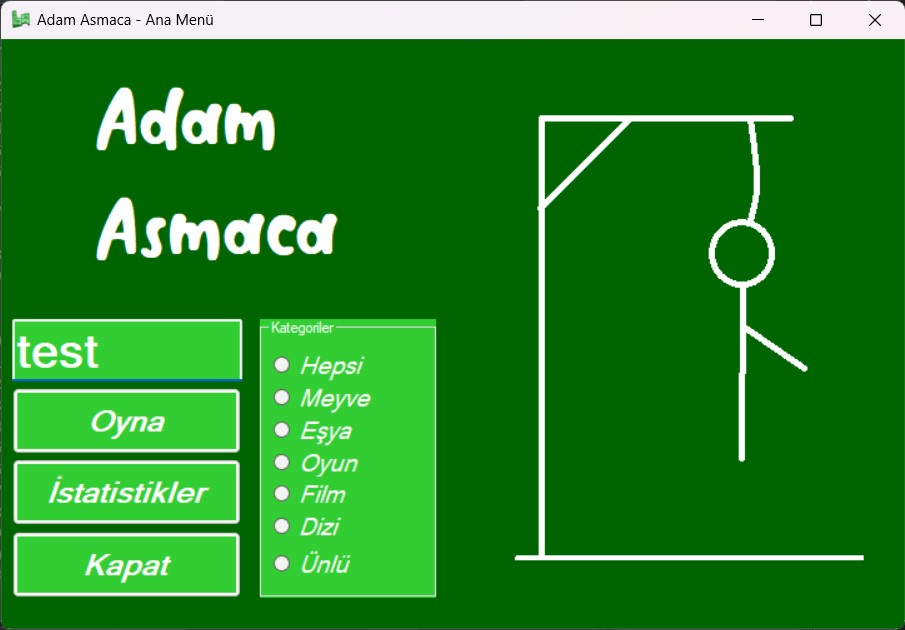
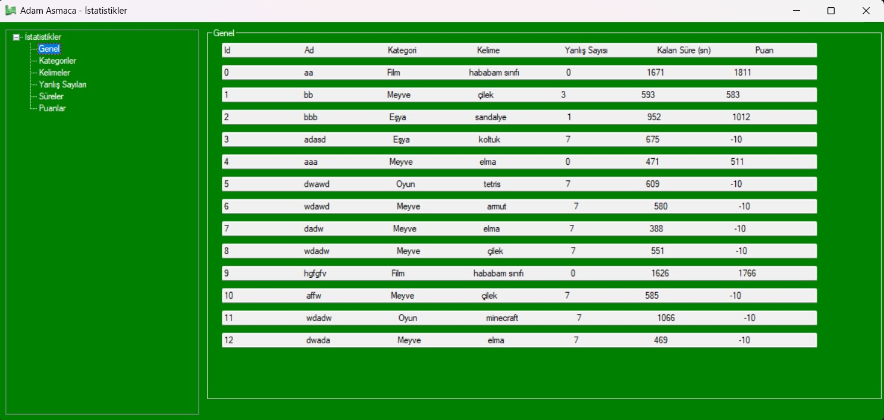
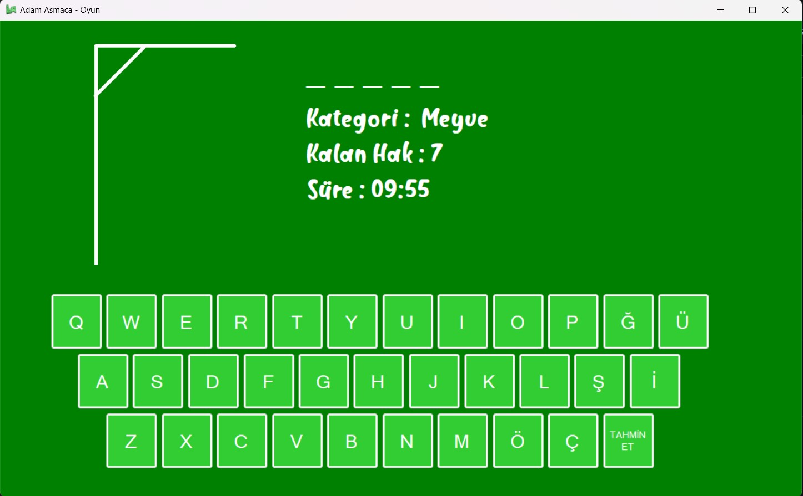

# Adam Asmaca Oyunu

Bu, C# dilini kullanarak geliştirilmiş bir adam asmaca oyunudur.
Oyun, bilgisayarın rastgele seçtiği bir kelimeyi doğru tahmin ederek oyunu kazanmayı amaçlar. 
Her yanlış tahminde, oyuncunun hakları azalır ve adam asılmaya başlar. 
Oyuncunun 7 hakkı vardır.

## Nasıl Çalıştırılır

1. Projeyi bilgisayarınıza klonlayın veya ZIP olarak indirin.
2. Visual Studio veya başka bir C# derleyici kullanarak projeyi açın.
3. Projeyi derleyin ve çalıştırın.
4. Oyunun ana ekranında, kategori seçebilir ve "Oyuna Başla" butonuna tıklayarak oyunu başlatabilirsiniz.

## Oyunun Amacı

Oyunun temel amacı, rastgele seçilen kelimeyi doğru tahmin ederek oyunu kazanmaktır.
Oyuncunun 7 hakkı vardır ve her yanlış tahminde adam asılmaya başlar.

## Kategoriler

Oyun, farklı kategorilerdeki kelimeleri içermektedir.
Oyuncular, oyun başlamadan önce bir kategori seçebilirler.

## İstatistikler

Oyun bitiminde, oyuncunun performansı istatistiklerle kaydedilir.
Kullanıcılar, istatistikler bölümünde detaylı performanslarını görebilirler.

## Ekran Görüntüleri

Projenin çalışma anını gösteren ekran görüntüleri aşağıda bulunabilir.

